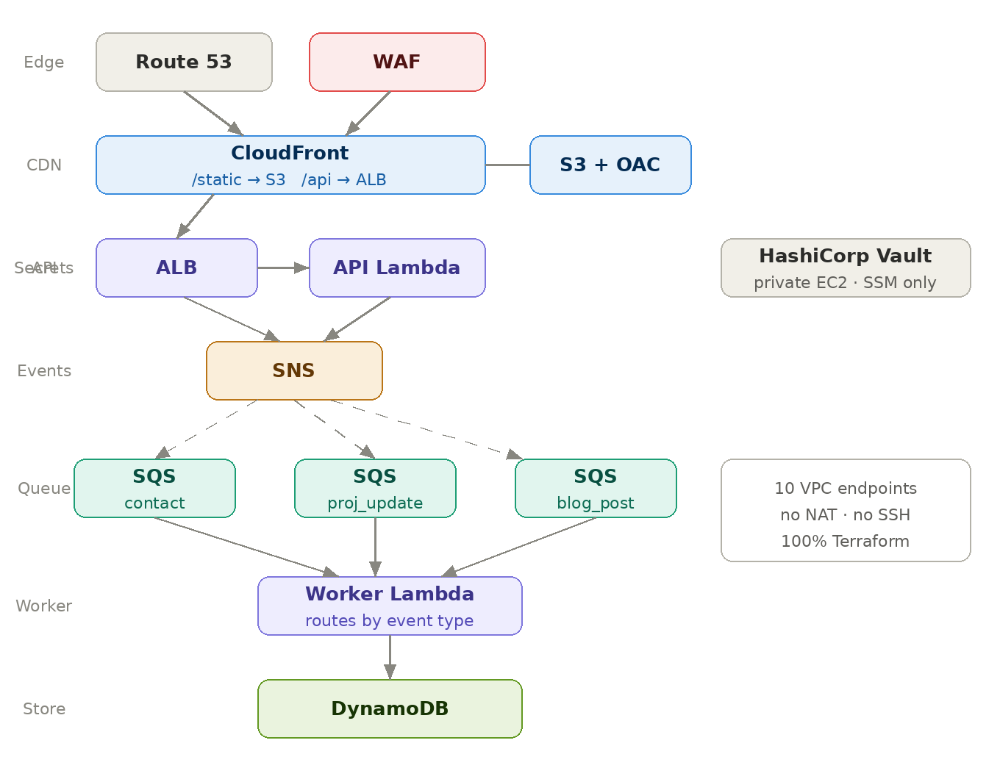

# Serverless AWS Portfolio Infrastructure

Production-grade, fully event-driven serverless infrastructure on AWS — built entirely with Terraform, deployed and validated end-to-end.

> Implementation code is maintained in a private repository. Available to verified recruiters and hiring engineers on request — [LinkedIn](https://www.linkedin.com/in/srestha-mridha/) or [email](mailto:sresthamridha@gmail.com).

> Infrastructure was destroyed after validation to avoid ongoing AWS costs. End-to-end proof is in screenshots. Can be redeployed with `terraform apply` in minutes.

> The frontend is a template. The infrastructure is the work.

---

## What This Does

A contact form submission on the portfolio site triggers a fully automated, event-driven write pipeline — entirely inside a private VPC with no internet egress and no open ports.

```
Browser
    │
    ▼
Route 53
    │
    ▼
WAF  (AWSManagedRulesCommonRuleSet)
    │
    ▼
CloudFront
    ├── /static/*  ──────────────────► S3  (via OAC)
    │
    └── /api/*
            │
            ▼
           ALB  [public subnet]
            │
            ▼
      API Lambda  [private subnet]
            │
            ▼
           SNS
            │
     ┌──────┼──────┐
     ▼      ▼      ▼
   SQS    SQS    SQS    (contact / project_update / blog_post)
     │      │      │
     └──────┴──────┘
            │
            ▼
     Worker Lambda  [private subnet]
            │
            ▼
         DynamoDB
```

All private subnet resources reach AWS services exclusively through VPC endpoints. No traffic leaves the VPC to the public internet.

---

## Architecture



---

## Stack

| Layer | Service | Why |
|---|---|---|
| DNS | Route 53 | Hosted zone, A record to CloudFront |
| Edge security | WAF | AWSManagedRulesCommonRuleSet at CDN edge |
| CDN | CloudFront | Global delivery, HTTPS enforcement, OAC |
| Static hosting | S3 + OAC | Private bucket, CloudFront-only access |
| API | ALB + Lambda | No 29s timeout ceiling vs API Gateway |
| Messaging | SNS + SQS | Async decoupling, per-event fan-out |
| Database | DynamoDB | Serverless, on-demand, single-table design |
| Secrets | HashiCorp Vault (EC2) | Vendor-agnostic, avoids Secrets Manager lock-in |
| Instance access | SSM Session Manager | No open ports, no key pairs, full audit trail |
| Observability | CloudWatch + X-Ray | Metrics, alarms, DLQ alerts, distributed tracing |
| IaC | Terraform | Modular, remote state, multi-environment |

---

## VPC Design

Two-tier subnet model. Only the ALB lives in the public subnet. Everything else is private.

```
VPC 10.0.0.0/16
├── Public  10.0.1.0/24  (AZ1)  — ALB
├── Public  10.0.4.0/24  (AZ2)  — ALB (multi-AZ requirement)
├── Private 10.0.2.0/24  (AZ1)  — Lambdas, Vault EC2, VPC endpoints
└── Private 10.0.3.0/24  (AZ2)  — Lambdas, VPC endpoints
```

**VPC Endpoints (10 total):**
- Gateway (free): S3, DynamoDB
- Interface: SQS, SNS, CloudWatch Logs, CloudWatch Metrics, X-Ray, SSM, SSMMessages, EC2Messages

---

## Key Design Decisions

**No NAT Gateway** — NAT Gateway costs ~$0.045/hr plus per-GB data charges. All AWS service calls route through VPC endpoints instead. Gateway endpoints (S3, DynamoDB) are free. Interface endpoints cost ~$0.01/hr each — still significantly cheaper at scale, and all traffic stays within the AWS private network.

**ALB over API Gateway** — API Gateway has a hard 29-second timeout ceiling. ALB + Lambda has no such limit, making it the right choice for any processing that might run longer than a simple CRUD operation.

**SNS fan-out to per-event SQS queues** — a single contact form submission fans out to three SQS queues (contact, project_update, blog_post). One Worker Lambda handles all event types via a switch on event type. Per-event Lambdas would be the right call when independent scaling or deployment isolation matters — not at this scale.

**Self-hosted HashiCorp Vault** — Vault is vendor-agnostic and transferable across any cloud or on-premise environment. Secrets Manager is excellent but AWS-specific. Vault also provides a richer access control model and avoids lock-in.

**SSM Session Manager** — zero open ports on any instance. Every session is logged via CloudTrail. No key pairs to rotate, lose, or leak.

**DLQ alarms at threshold zero** — any message in a DLQ means a processing failure. Alarms fire on the first failed message, not after N failures. Silent data loss is worse than a noisy alarm.

---

## 21 Engineering Challenges — The Most Significant

This project involved 21 documented challenges across two phases: Terraform infrastructure build and live end-to-end validation. These are the ones that took the longest to find and fix.

---

### 1. Gateway endpoint prefix list egress

**What broke:** Lambda in private subnet timing out on DynamoDB calls. No access denied error — just a silent timeout.

**Why:** DynamoDB uses a Gateway endpoint, not an Interface endpoint. Gateway endpoints require a `prefix_list_ids` egress rule on the Lambda security group — not a `source_security_group_id`. This is non-obvious and completely undocumented in most tutorials.

**Fix:** Added a `prefix_list_ids` egress rule referencing the DynamoDB Gateway endpoint's managed prefix list.

**Why it matters:** This is exactly the kind of failure that appears only in production — not in dev environments that use NAT or internet access. It fails silently with a timeout, giving no indication of the real cause.

---

### 2. CloudFront blocking POST bodies

**What broke:** Contact form submissions hitting the API path returned 403 or arrived at Lambda with an empty body.

**Why:** CloudFront's default cache behaviour strips POST bodies and blocks non-GET methods unless explicitly configured to forward them.

**Fix:** Set `headers = ["*"]` and `min_ttl = 0` on the API cache behavior in Terraform. CloudFront requires both — forwarding headers alone isn't enough.

---

### 3. Circular security group dependency

**What broke:** `terraform apply` failed with a dependency cycle error on security group rules.

**Why:** Security group A referenced security group B, and B referenced A — standard for ALB-to-Lambda traffic. Terraform can't create both simultaneously.

**Fix:** Separated `aws_security_group` and `aws_security_group_rule` into distinct resources. Created empty security groups first, then attached rules independently. This is the correct Terraform pattern for bidirectional SG references.

---

### 4. WAF in us-east-1 while stack is in another region

**What broke:** Terraform plan failed — WAF WebACL for CloudFront must exist in `us-east-1` regardless of the stack's primary region.

**Fix:** Added a second AWS provider with `alias = "us_east_1"` and `region = "us-east-1"`. Passed it explicitly to the WAF resource. The CloudFront distribution references the WAF ARN — both now in the correct region.

---

### 5. S3 direct access returning 403 instead of being blocked

**What broke:** Direct S3 URL returned 403 — expected, but the error message revealed the bucket name, which is an information leak.

**Fix:** Enabled S3 Block Public Access at the bucket level, confirmed OAC was the only allowed origin, and validated that direct access returns a generic XML error without exposing bucket details.

---

### 6. Lambda cold start timeouts under ALB

**What broke:** First request after a period of inactivity occasionally timed out at the ALB health check threshold.

**Fix:** Increased ALB target group timeout and Lambda timeout values. Noted that provisioned concurrency is the production-grade solution — not used here to keep costs zero, but documented as the right call for real traffic.

---

### 7. SNS subscription confirmation hanging

**What broke:** SNS-to-SQS subscriptions created by Terraform showed as `PendingConfirmation` and never delivered messages.

**Why:** Raw message delivery was disabled and the subscription was waiting for an HTTP confirmation endpoint that didn't exist.

**Fix:** Set `raw_message_delivery = true` on all SQS subscriptions. For SQS (not HTTP) endpoints, raw delivery skips the confirmation handshake entirely.

---

### 8. Worker Lambda not triggering from SQS

**What broke:** Messages appeared in SQS but Worker Lambda never fired.

**Why:** The Lambda execution role was missing `sqs:ReceiveMessage`, `sqs:DeleteMessage`, and `sqs:GetQueueAttributes`. The event source mapping existed but silently failed.

**Fix:** Added the correct SQS permissions to the execution role. Also added `sqs:ChangeMessageVisibility` — required for the Lambda service to extend message visibility during processing.

---

### 9. DynamoDB write failing with AccessDeniedException

**What broke:** Worker Lambda could receive from SQS but failed writing to DynamoDB.

**Why:** The Lambda execution role had `dynamodb:PutItem` but the table used a KMS customer-managed key. The role also needed `kms:GenerateDataKey` and `kms:Decrypt`.

**Fix:** Added KMS permissions scoped to the specific key ARN. Principle of least privilege — only the exact key used by the table.

---

### 10. Vault EC2 unreachable after deploy

**What broke:** Could not reach Vault after `terraform apply`. No SSH, no open ports — intentional. But SSM Session Manager also wasn't working.

**Why:** The EC2 instance profile was attached but SSM Agent wasn't able to register because the `ssmmessages` and `ec2messages` VPC endpoints weren't yet created.

**Fix:** Added Interface endpoints for SSM, SSMMessages, and EC2Messages. SSM Agent requires all three to function in a private subnet. After endpoint creation, Session Manager connected immediately.

---

## Terraform Module Structure

```
├── environments/
│   ├── dev/backend.tfvars
│   └── prod/backend.tfvars
└── modules/
    ├── vpc/            — VPC, subnets, SGs, endpoints
    ├── iam/            — roles, least-privilege policies
    ├── database/       — DynamoDB, PITR, encryption
    ├── messaging/      — SNS, SQS, DLQs, subscriptions
    ├── lambda/         — API Lambda, Worker Lambda
    ├── alb/            — Application Load Balancer
    ├── frontend/       — S3, CloudFront, WAF, OAC
    ├── vault/          — HashiCorp Vault on EC2
    ├── observability/  — CloudWatch, X-Ray, DLQ alarms
    └── ssm_access/     — SSM instance profile
```

---

## Validated End-to-End

Infrastructure was fully deployed and validated live before teardown:

| Evidence | What it proves |
|---|---|
| Live portfolio at CloudFront URL | Static site serving from private S3 via OAC |
| All 10 VPC endpoints active | No NAT Gateway, all traffic private |
| Real form submission in DynamoDB | Full write pipeline working end-to-end |
| Vault EC2 accessible via SSM | Zero open ports, no SSH anywhere |
| CloudWatch dashboard live | Lambda metrics, alarms active |
| 6 SQS queues (3 main + 3 DLQ) | Per-event fan-out working |

---

**Srestha Mridha** · Cloud & DevOps Engineer · Kolkata, India  
[LinkedIn](https://www.linkedin.com/in/srestha-mridha/) · [GitHub](https://github.com/SresthaMridha) · [sresthamridha@gmail.com](mailto:sresthamridha@gmail.com)
